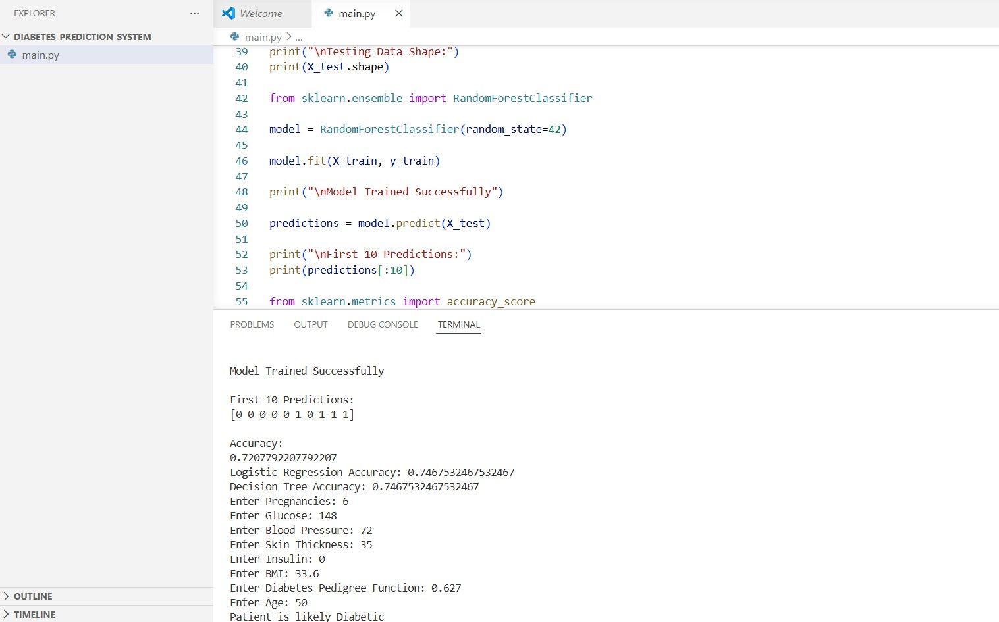

# Diabetes Detection Using Machine Learning
## Overview
This project predicts whether a person is likely to have diabetes based on health parameters using Machine Learning. It is developed in Python using multiple classification algorithms to provide accurate predictions.
## Features
- Predicts whether a person is diabetic or non-diabetic.
- Compares the performance of multiple machine learning models.
- Displays model accuracy.
- Accepts user input for prediction.
- Shows diabetes distribution graph.
- Displays model accuracy comparison graph.
- Provides basic health recommendation based on prediction.
## Technologies Used
- Python
- Pandas
- NumPy
- Scikit-learn
- Matplotlib
## Dataset Features
- Pregnancies
- Glucose
- Blood Pressure
- Skin Thickness
- Insulin
- BMI
- Diabetes Pedigree Function
- Age
- Outcome
## Machine Learning Model
- Logistic Regression
- Decision Tree Classifier
- Random Forest Classifier
- Best Model Accuracy: **(Update with your obtained accuracy)**
## Project Files
- `diabetes_detection.py` – Main program
- `diabetes.csv` – Dataset
- `sample_output.png` – Sample output
## Sample Output
The system displays:

- Diabetes Prediction
- Model Accuracy
- Accuracy Comparison
- Diabetes Distribution Graph
- Health Recommendation
## Future Improvements
- Web application using Flask or Streamlit
- Mobile healthcare application
- Real-time patient health monitoring
- Integration with healthcare APIs
- Improved prediction using advanced machine learning models
